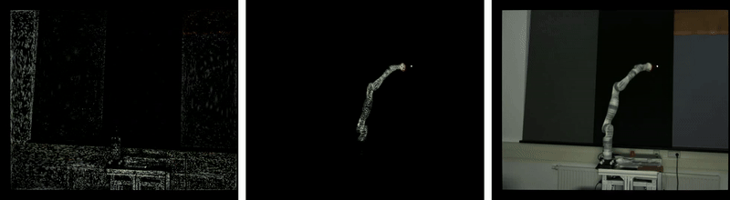
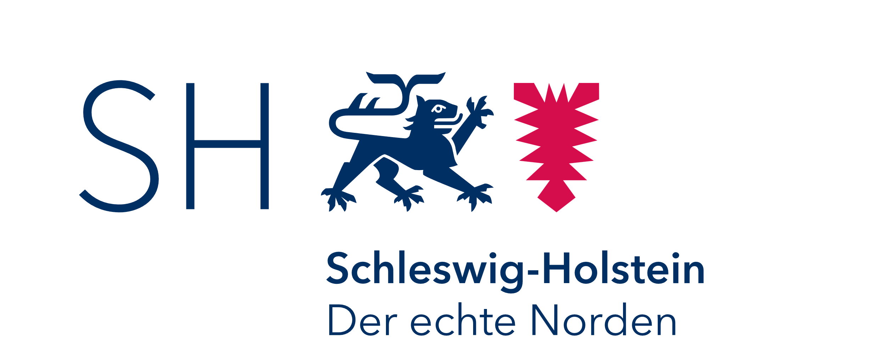
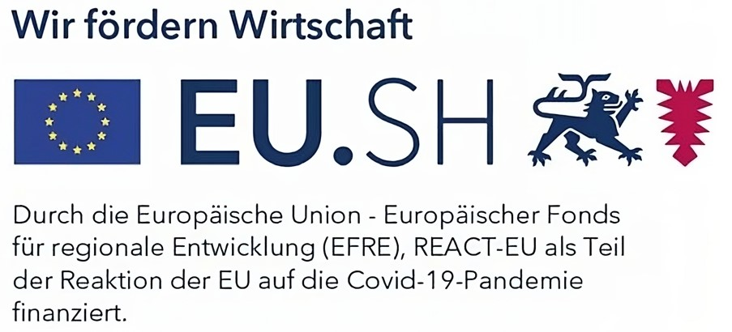
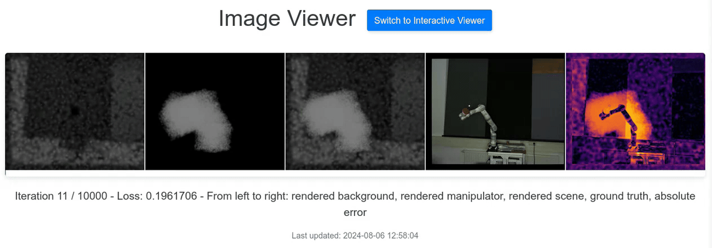
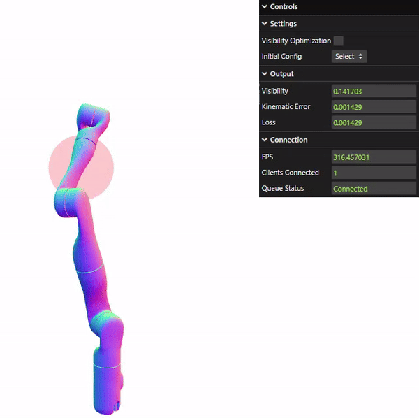

# Occlusion Avoidance for Robotic Manipulators using Rigid Gaussian Splatting
J. Nazarenus, S. Reichhuber, R. Koch, S. Tomforde, S. Kou, F. Zhang

This repository contains the official implementation of the paper *Occlusion Avoidance for Robotic Manipulators using Rigid Gaussian Splatting*. The paper is a post-publication and extension of the conference paper [*Learning Occlusions in Robotic Systems: How to Prevent Robots from Hiding Themselves*](https://github.com/jna-358/occlusion_robots_hiding).

    

# Funding
This research was supported by the *Catalyst: Leaders Julius von Haast Fellowship (23-VUW-019-JVH)*. Additionally, it received funding from the project *OP der Zukunft*, which is part of the *Recovery Assistance for Cohesion and the Territories of Europe (REACT-EU)* program.

# Prequisites
This repository includes a Dockerfile to ensure a consistent environment. To build the Docker image, run the script `build_docker.sh`. Afterwards, you can start the container with `run_docker.sh`.

# Usage
The script `run.py` provides a convenient way to run the different parts of the pipeline. The following commands are available:

param | Explanation
--- | --- 
`smooth_random` | Generates a smooth random trajectory for the manipulator
`rigid_gaussians_train` | Reconstructs a volumetric model of the manipulator
`rigid_gaussians_interactive` | Renders the reconstructed model in real-time
`mlp_blender_train` | Trains the occlusion avoidance model on synthetic blender data
`mlp_blender_eval` | Evaluates a trained occlusion avoidance model on synthetic blender data
`mlp_real_world` | Trains the occlusion avoidance model on real-world data of increasing dataset size
`mlp_gaussians_train` | Trains the occlusion avoidance model on the rigid gaussians dataset
`mlp_gaussians_eval` | Evaluates a trained occlusion avoidance model on the rigid gaussians dataset
`mlp_application_nullspace` | Optimizes a configuration in order to improve the visibility with a fixed end-effector position
`mlp_application_trajectory` | Optimizes a trajectory with fixed start and end configurations

# Visualizations
## Rigid Gaussians Training
During training (`rigid_gaussians_train`), go to `http://127.0.0.1:5000/` to observe the training progress.

## Rigid Gaussians Interactive
After running the interactive script (`rigid_gaussians_interactive`), go to `http://127.0.0.1:5000/interactive` to change the joint angles and view the rendered result in real-time.

## Occlusion Avoidance
An interactive demo is available at [this link](https://robots-hiding.nazarenus.dev). Keep in mind that due to network latencies or high demand, the optimization speed and responsiveness of the animation may vary.

## AI-Assisted Coding
During the development of this project, we used the [GitHub Copilot](https://github.com/features/copilot) plugin for [Visual Studio Code](https://code.visualstudio.com/docs/copilot/overview) for semantic code completion.